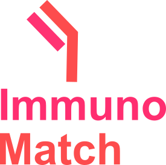

# ImmunoMatch

ImmunoMatch is a machine learning framework for deciphering the molecular rules governing the pairing of antibody chains. Fine-tuned on an antibody-specific language model ([AntiBERTA2](https://www.google.com/url?sa=t&source=web&rct=j&opi=89978449&url=https://www.biorxiv.org/content/10.1101/2023.12.12.569610v1)), ImmunoMatch learns from paired H and L sequences from single human B cells to distinguish cognate H-L pairs and randomly paired sequences. 

A total of three variants of ImmunoMatch, trained on different subsets of the data, are made available on huggingface:

| Checkpoint name | Trained on |
| --------------- | ---------- |
| [ImmunoMatch](https://huggingface.co/fraternalilab/immunomatch) | A mixture of antibodies with both κ and λ light chains |
| [ImmunoMatch-κ](https://huggingface.co/fraternalilab/immunomatch-kappa) | Antibodies with κ light chains |
| [ImmunoMatch-λ](https://huggingface.co/fraternalilab/immunomatch-lambda) | Antibodies with λ light chains |
